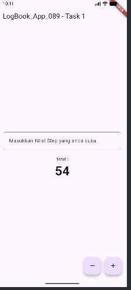
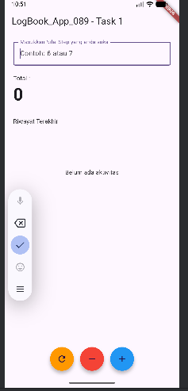

# logbook_app_089
Tugas Pemrograman Mobile - Modul Proyek 4

## Deskripsi Tugas

### Task 1: The Multi-Step Counter (Low Order Thinking - LOTS)
**Fokus:** Implementasi logika dasar dan manipulasi variabel.

Pada tugas ini, aplikasi Counter dimodifikasi agar tidak hanya bertambah satu demi satu, melainkan memiliki nilai **"Step"** (Langkah) yang dinamis.

**Spesifikasi & Kriteria:**
- [x] **Controller:** Menambahkan variabel `_step` (default: 1) dan fungsi untuk mengubah nilainya.
- [x] **Logic:** Fungsi `increment` dan `decrement` menggunakan nilai `_step`.
- [x] **View:** Menambahkan `TextField` pada `CounterView` untuk menentukan besarnya nilai step.
- [x] **Kriteria Selesai:** Nilai counter berubah sesuai input step dan logika tetap berada di `CounterController`.

---

### Task 2: The History Logger (High Order Thinking - HOTS)
**Fokus:** Analisis struktur data dan manajemen state.

Aplikasi ditambahkan fitur "Riwayat" sederhana untuk mencatat aktivitas pengguna setiap kali melakukan aksi pada counter.

**Spesifikasi & Kriteria:**
- [ ] **Analysis:** Menggunakan tipe data `List<String>` untuk menampung riwayat aktivitas.
- [ ] **Controller:** Implementasi List private di `CounterController`. Setiap aksi (`increment`, `decrement`, `reset`) otomatis menambahkan catatan baru.
- [ ] **View:** Menampilkan daftar riwayat di bawah angka Counter menggunakan widget `ListView` atau `Column`.
- [ ] **The Twist:** Implementasi logika agar riwayat hanya menampilkan **5 aktivitas terakhir** saja.
- [ ] **Kriteria Selesai:** Riwayat bertambah secara real-time dan mahasiswa mampu menjelaskan alasan penggunaan `List`.

---

## Screenshot
### Task 1: Multi-Step Counter

### Task 2: The History Logger

## Self Reflection
Prinsip SRP membuat logika counter dan pencatatan riwayat terpisah di `CounterController`, sehingga penambahan fitur History Logger hanya menyentuh satu area tanggung jawab tanpa mengubah UI atau logika lainnya.

