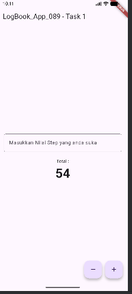
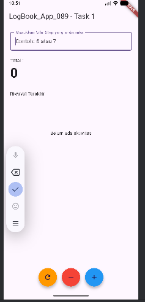
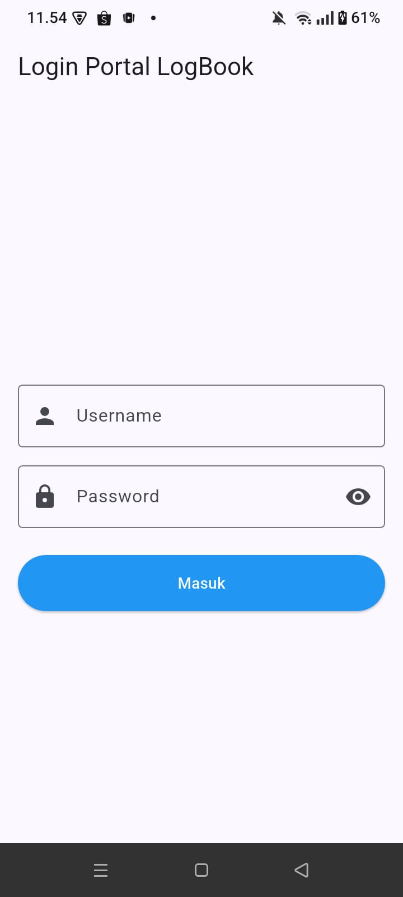
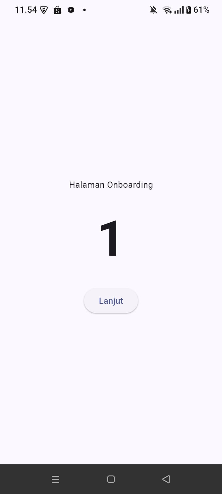
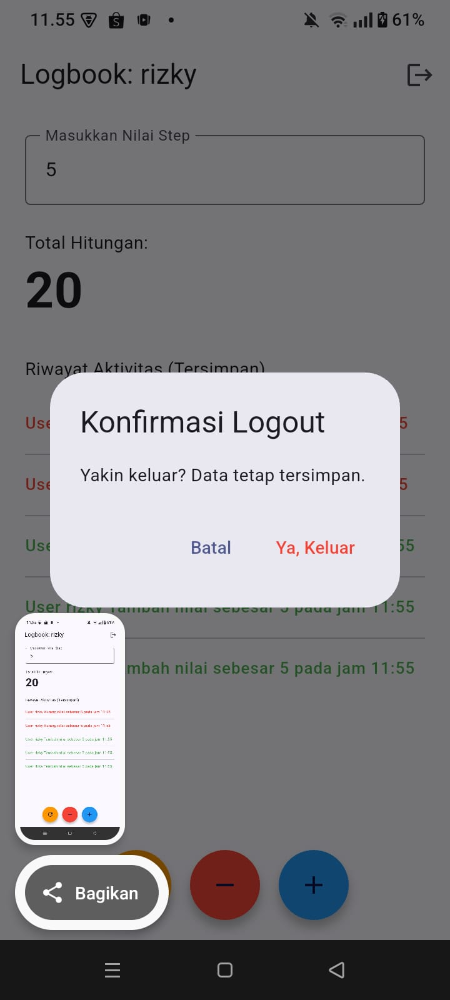
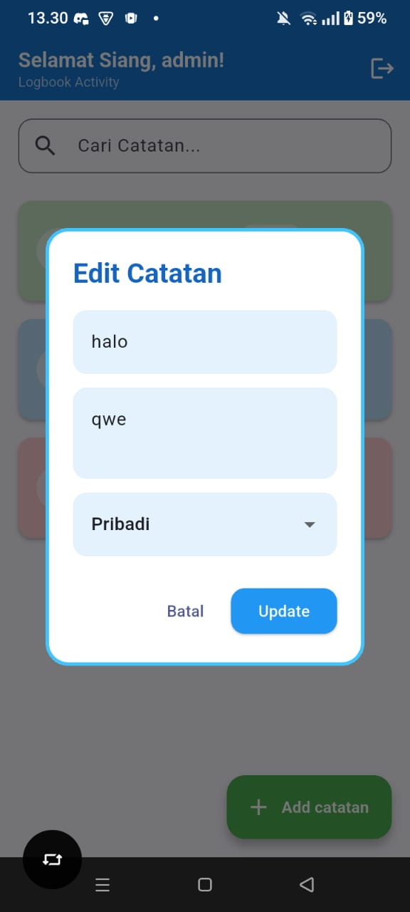
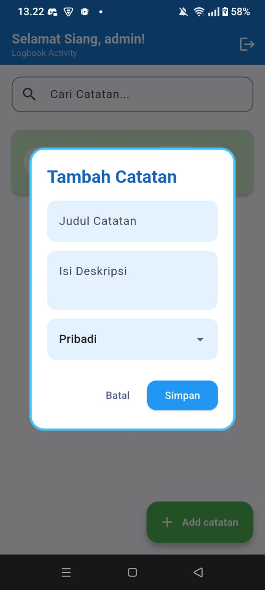
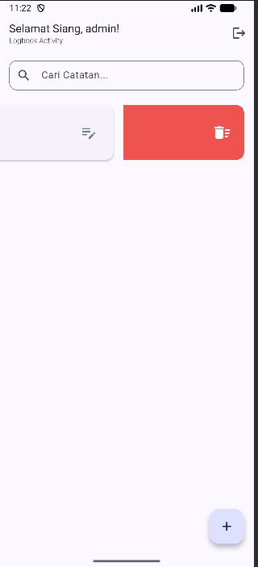

# logbook_app_089
Tugas Pemrograman Mobile - Politeknik Negeri Bandung

## Deskripsi Tugas

---

## 📂 MODUL 1: Basic Counter Logic

### Task 1: The Multi-Step Counter (Low Order Thinking - LOTS)
**Fokus:** Implementasi logika dasar dan manipulasi variabel.
Modifikasi aplikasi Counter agar memiliki nilai **"Step"** (Langkah) yang dinamis.

**Spesifikasi & Kriteria:**
- [x] **Controller:** Menambahkan variabel `_step` (default: 1) dan fungsi untuk mengubah nilainya.
- [x] **Logic:** Fungsi `increment` dan `decrement` menggunakan nilai `_step`.
- [x] **View:** Menambahkan `TextField` pada `CounterView` untuk menentukan besarnya nilai step.

### Task 2: The History Logger (High Order Thinking - HOTS)
**Fokus:** Analisis struktur data dan manajemen state.
Fitur "Riwayat" sederhana untuk mencatat aktivitas pengguna.

**Spesifikasi & Kriteria:**
- [x] **Analysis:** Menggunakan tipe data `List<String>` atau `List<Object>` untuk menampung riwayat.
- [x] **Controller:** Implementasi List private. Setiap aksi otomatis menambahkan catatan baru.
- [x] **Twist:** Logika agar riwayat dibatasi (misal: 5 aktivitas terakhir).

---

## 🔐 MODUL 2: Authentication & Navigation

Pada modul ini, aplikasi menerapkan arsitektur **Modular** (`features/auth`, `features/logbook`, `features/onboarding`) dan bertindak sebagai Gatekeeper.

### Task 1: Tugas Pendahuluan (UI & Assets)
**Fokus:** Persiapan aset dan Onboarding.

**Implementasi:**
- [x] **Assets:** Menambahkan gambar ilustrasi ke dalam folder `assets/images` dan mendaftarkannya di `pubspec.yaml`.
- [x] **Onboarding:** Membuat halaman pengenalan dengan navigasi `pushReplacement` menuju Login.

### Task 2: The Login Portal (LOTS)
**Fokus:** Validasi Input, Security Logic, dan Multiple Users.

**Spesifikasi & Kriteria:**
- [x] **Multiple Users:** Controller menggunakan `Map<String, String>` untuk menyimpan banyak akun (contoh: admin, budi).
- [x] **Security:** Jika salah password 3 kali, tombol login terkunci (disabled) selama 10 detik.
- [x] **UX:** Fitur *Show/Hide Password* (ikon mata) dan Validasi Form (tidak boleh kosong).

### Task 3: Persistent History Logger (HOTS)
**Fokus:** Data Persistence (Shared Preferences) dan JSON Serialization.

**Spesifikasi & Kriteria:**
- [x] **Persistence:** Menggunakan library `shared_preferences` agar data angka dan riwayat **tidak hilang** saat aplikasi ditutup/restart.
- [x] **Serialization:** Mengubah data Objek Riwayat menjadi JSON String agar bisa disimpan di memori lokal.
- [x] **Integration:** Mengirimkan nama user (`username`) dari halaman Login ke Counter untuk dicatat di riwayat (Passing Data).

---

## 📝 MODUL 3: Data Modeling & Dynamic Lists

Pada modul ini, aplikasi bertransformasi dari sekadar penghitung angka menjadi aplikasi sistem Logbook Digital yang fungsional dengan arsitektur yang mendukung *Dependency Inversion* dan *Reactive Programming*.

### Task 1: Tugas Pendahuluan
**Fokus:** Pemahaman teoritis mengenai Class, Mapping Data, dan teknik Rendering UI.
- [x] **Konsep Model:** Membuat Class Dart dengan *Constructor* yang menggunakan *Named Parameters*.
- [x] **Mapping Data:** Menggunakan fungsi `jsonEncode()` dan `jsonDecode()` untuk konversi data Object ke format JSON String.
- [x] **Analisis:** Mengapa `ListView.builder` lebih efisien (Lazy Loading) daripada penggunaan `Column` di dalam `SingleChildScrollView`.

### Task 2: The Daily Logger (LOTS)
**Fokus:** Implementasi CRUD (Create, Read, Update, Delete) dasar dan menampilkan data dinamis.

**Spesifikasi & Kriteria Selesai di Lab (70%):**
- [x] Berhasil menambah, mengedit, dan menghapus item dari daftar secara *real-time*.
- [x] Daftar catatan tampil rapi menggunakan widget `ListView.builder`.
- [x] Menggunakan Class Model (`LogModel`) sebagai standar data, bukan String mentah.

### Task 3: Reactive List Management (MOTS)
**Fokus:** Menerapkan pemrograman reaktif agar antarmuka UI tersinkronisasi secara otomatis.

**Spesifikasi & Kriteria Selesai di Lab (70%):**
- [x] UI terupdate secara otomatis tanpa penggunaan `setState()` manual pada fungsi CRUD berkat penggunaan `ValueListenableBuilder`.
- [x] Logika reaktif terpusat di dalam file Controller menggunakan tipe data `ValueNotifier`.

### Task 4: Persistent JSON Storage (HOTS)
**Fokus:** Menyimpan kumpulan objek ke penyimpanan lokal secara permanen menggunakan format JSON.

**Spesifikasi & Kriteria Selesai di Lab (70%):**
- [x] Seluruh daftar catatan tidak hilang meskipun aplikasi dilakukan *Hot Restart* atau ditutup.
- [x] Proses *encoding* (Object ke JSON) dan *decoding* (JSON ke Object) berjalan sukses tanpa error saat menyimpan (`saveToDisk`) maupun memuat data (`loadFromDisk`).

### Homework & UI/UX Enhancements (30%)
- [x] **Search Feature:** Fitur pencarian *real-time* menggunakan input text yang tersinkronisasi dengan list data.
- [x] **Swipe to Delete:** Fitur menghapus catatan secara intuitif menggunakan widget `Dismissible` dengan animasi geser.
- [x] **Empty State:** Menampilkan ilustrasi khusus saat daftar catatan kosong atau pencarian tidak ditemukan.

---

## 📸 Screenshots

### Modul 1: Counter & Logic
| Multi-Step Counter | History Logger |
|:---:|:---:|
|  |  |

### Modul 2: Auth & Persistence
| Halaman Login | Halaman Counter (User) | Alert Logout |
|:---:|:---:|:---:|
|  |  |  |

### Modul 3: Data Modeling & Dynamic Lists
| Tampilan Edit | Form Dialog Tambah | Fitur Swipe to Delete |
|:---:|:---:|:---:|
|  |  |  |

---
## 🧠 Self Reflection (Lesson Learnt)

### Modul 1
Prinsip SRP membuat logika counter dan pencatatan riwayat terpisah di `CounterController`.

### Modul 2
1. **Arsitektur Modular:** Memisahkan fitur ke dalam folder `features/` membuat kode lebih rapi, meskipun harus teliti dalam mengatur *import path*.
2. **Navigation Stack:** Memahami perbedaan `pushReplacement` (untuk Login) dan `pushAndRemoveUntil` (untuk Logout) sangat penting demi keamanan alur aplikasi.
3. **Data Persistence:** Tantangan terbesar adalah menyimpan List Object ke Shared Preferences yang membutuhkan proses encode/decode JSON.

### Modul 3
1. **Konsep Baru:** Baru menyadari kekuatan sebenarnya dari Reactive Programming di Flutter. Penggunaan kombinasi `ValueNotifier` dan `ValueListenableBuilder` ternyata memungkinkan antarmuka (UI) untuk diperbarui secara otomatis ketika ada perubahan data tanpa perlu memanggil `setState()` berulang kali.
2. **Kemenangan Kecil:** Berhasil membuat fungsionalitas CRUD berjalan mulus dengan UI yang dinamis, serta sukses menghilangkan warning garis kuning terkait penggunaan `BuildContext` di dalam fungsi asynchronous (async/await) hanya dengan menambahkan baris pengecekan `if (!mounted)`.
3. **Target Berikutnya:** Ingin mempelajari cara menghubungkan aplikasi logbook ini ke layanan Backend-as-a-Service (BaaS) seperti Supabase atau MongoDB atau membuat REST API sendiri. Tujuannya agar data tidak hanya tersimpan secara lokal di memori HP, tetapi juga bisa tersinkronisasi dan diakses melalui cloud.