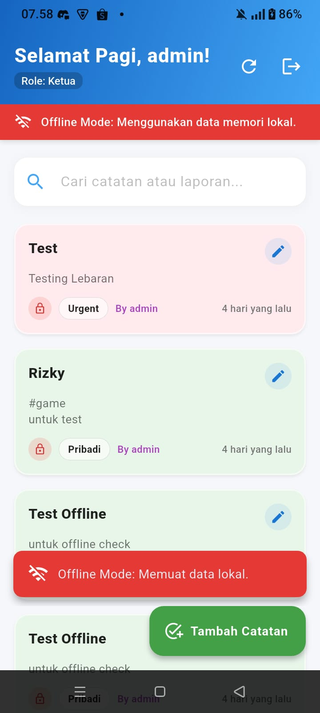
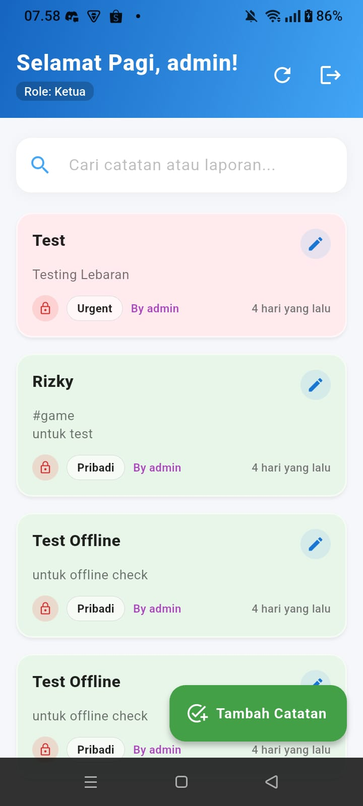
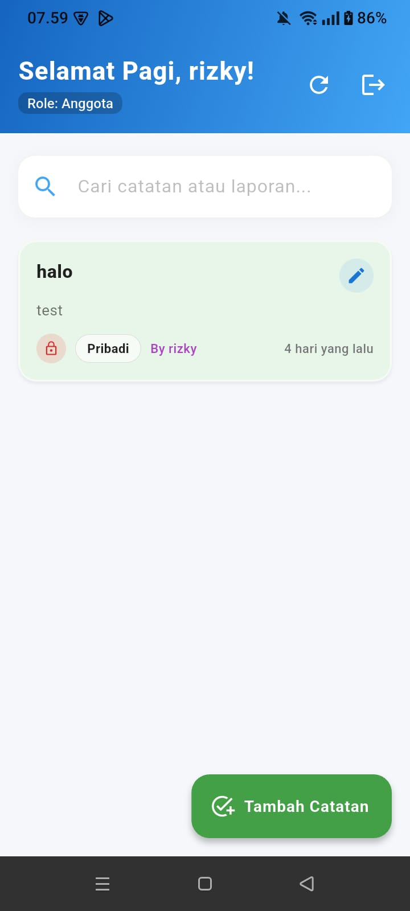
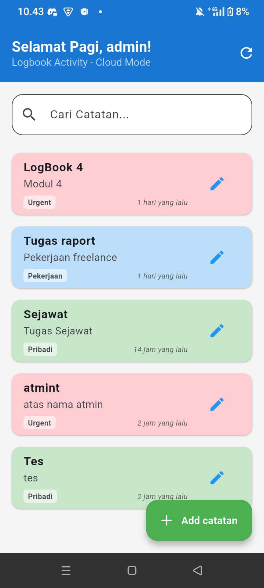
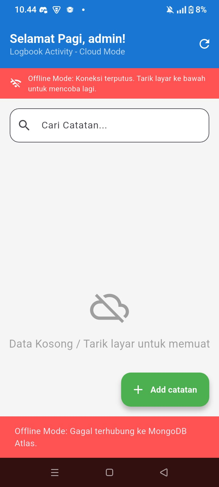
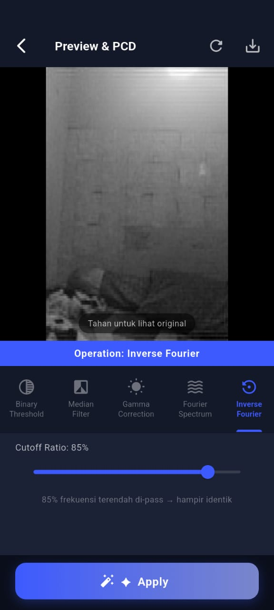
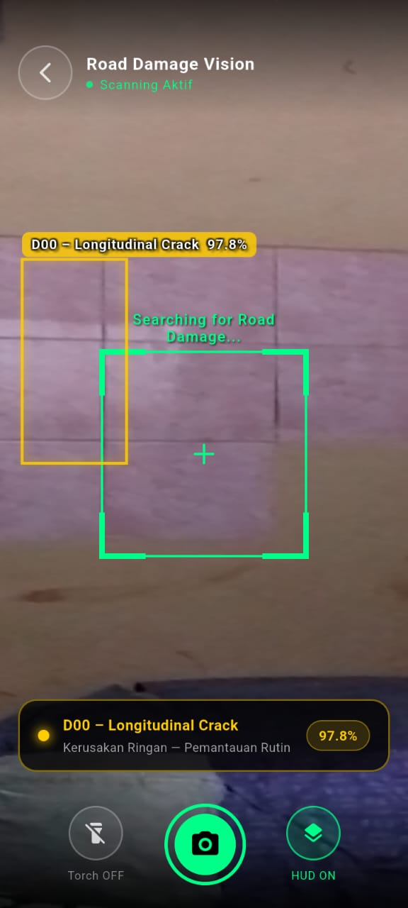

# logbook_app_089
Tugas Pemrograman Mobile - Politeknik Negeri Bandung

## Deskripsi Tugas

---

## 📂 MODUL 1: Basic Counter Logic

### Task 1: The Multi-Step Counter (Low Order Thinking - LOTS)
**Fokus:** Implementasi logika dasar dan manipulasi variabel.
Modifikasi aplikasi Counter agar memiliki nilai **"Step"** (Langkah) yang dinamis.

**Spesifikasi & Kriteria:**
- [x] **Controller:** Menambahkan variabel `_step` (default: 1) dan fungsi untuk mengubah nilainya.
- [x] **Logic:** Fungsi `increment` dan `decrement` menggunakan nilai `_step`.
- [x] **View:** Menambahkan `TextField` pada `CounterView` untuk menentukan besarnya nilai step.

### Task 2: The History Logger (High Order Thinking - HOTS)
**Fokus:** Analisis struktur data dan manajemen state.
Fitur "Riwayat" sederhana untuk mencatat aktivitas pengguna.

**Spesifikasi & Kriteria:**
- [x] **Analysis:** Menggunakan tipe data `List<String>` atau `List<Object>` untuk menampung riwayat.
- [x] **Controller:** Implementasi List private. Setiap aksi otomatis menambahkan catatan baru.
- [x] **Twist:** Logika agar riwayat dibatasi (misal: 5 aktivitas terakhir).

---

## 🔐 MODUL 2: Authentication & Navigation

Pada modul ini, aplikasi menerapkan arsitektur **Modular** (`features/auth`, `features/logbook`, `features/onboarding`) dan bertindak sebagai Gatekeeper.

### Task 1: Tugas Pendahuluan (UI & Assets)
**Fokus:** Persiapan aset dan Onboarding.

**Implementasi:**
- [x] **Assets:** Menambahkan gambar ilustrasi ke dalam folder `assets/images` dan mendaftarkannya di `pubspec.yaml`.
- [x] **Onboarding:** Membuat halaman pengenalan dengan navigasi `pushReplacement` menuju Login.

### Task 2: The Login Portal (LOTS)
**Fokus:** Validasi Input, Security Logic, dan Multiple Users.

**Spesifikasi & Kriteria:**
- [x] **Multiple Users:** Controller menggunakan `Map<String, String>` untuk menyimpan banyak akun (contoh: admin, budi).
- [x] **Security:** Jika salah password 3 kali, tombol login terkunci (disabled) selama 10 detik.
- [x] **UX:** Fitur *Show/Hide Password* (ikon mata) dan Validasi Form (tidak boleh kosong).

### Task 3: Persistent History Logger (HOTS)
**Fokus:** Data Persistence (Shared Preferences) dan JSON Serialization.

**Spesifikasi & Kriteria:**
- [x] **Persistence:** Menggunakan library `shared_preferences` agar data angka dan riwayat **tidak hilang** saat aplikasi ditutup/restart.
- [x] **Serialization:** Mengubah data Objek Riwayat menjadi JSON String agar bisa disimpan di memori lokal.
- [x] **Integration:** Mengirimkan nama user (`username`) dari halaman Login ke Counter untuk dicatat di riwayat (Passing Data).

---

## 📝 MODUL 3: Data Modeling & Dynamic Lists

Pada modul ini, aplikasi bertransformasi dari sekadar penghitung angka menjadi aplikasi sistem Logbook Digital yang fungsional dengan arsitektur yang mendukung *Dependency Inversion* dan *Reactive Programming*.

### Task 1: Tugas Pendahuluan
**Fokus:** Pemahaman teoritis mengenai Class, Mapping Data, dan teknik Rendering UI.
- [x] **Konsep Model:** Membuat Class Dart dengan *Constructor* yang menggunakan *Named Parameters*.
- [x] **Mapping Data:** Menggunakan fungsi `jsonEncode()` dan `jsonDecode()` untuk konversi data Object ke format JSON String.
- [x] **Analisis:** Mengapa `ListView.builder` lebih efisien (Lazy Loading) daripada penggunaan `Column` di dalam `SingleChildScrollView`.

### Task 2: The Daily Logger (LOTS)
**Fokus:** Implementasi CRUD (Create, Read, Update, Delete) dasar dan menampilkan data dinamis.

**Spesifikasi & Kriteria Selesai di Lab (70%):**
- [x] Berhasil menambah, mengedit, dan menghapus item dari daftar secara *real-time*.
- [x] Daftar catatan tampil rapi menggunakan widget `ListView.builder`.
- [x] Menggunakan Class Model (`LogModel`) sebagai standar data, bukan String mentah.

### Task 3: Reactive List Management (MOTS)
**Fokus:** Menerapkan pemrograman reaktif agar antarmuka UI tersinkronisasi secara otomatis.

**Spesifikasi & Kriteria Selesai di Lab (70%):**
- [x] UI terupdate secara otomatis tanpa penggunaan `setState()` manual pada fungsi CRUD berkat penggunaan `ValueListenableBuilder`.
- [x] Logika reaktif terpusat di dalam file Controller menggunakan tipe data `ValueNotifier`.

### Task 4: Persistent JSON Storage (HOTS)
**Fokus:** Menyimpan kumpulan objek ke penyimpanan lokal secara permanen menggunakan format JSON.

**Spesifikasi & Kriteria Selesai di Lab (70%):**
- [x] Seluruh daftar catatan tidak hilang meskipun aplikasi dilakukan *Hot Restart* atau ditutup.
- [x] Proses *encoding* (Object ke JSON) dan *decoding* (JSON ke Object) berjalan sukses tanpa error saat menyimpan (`saveToDisk`) maupun memuat data (`loadFromDisk`).

### Homework & UI/UX Enhancements (30%)
- [x] **Search Feature:** Fitur pencarian *real-time* menggunakan input text yang tersinkronisasi dengan list data.
- [x] **Swipe to Delete:** Fitur menghapus catatan secara intuitif menggunakan widget `Dismissible` dengan animasi geser.
- [x] **Empty State:** Menampilkan ilustrasi khusus saat daftar catatan kosong atau pencarian tidak ditemukan.

---

## ☁️ MODUL 4: Cloud Integration & Secure Workflow

Pada modul ini, aplikasi melakukan migrasi penyimpanan dari memori lokal menuju **MongoDB Atlas Cloud Database**, dilengkapi dengan protokol keamanan dan integrasi *Asynchronous UI*.

### Task 1: Tugas Pendahuluan
**Fokus:** Pemahaman teoritis arsitektur *Client-Server*, keamanan kredensial, dan manajemen proses *asynchronous*.
- [x] [cite_start]**Konsep Cloud:** Memahami perbedaan *Client-Side Application* dan *Database Server*[cite: 853].
- [x] [cite_start]**Environment:** Memahami urgensi penggunaan file `.env` dan `.gitignore` untuk melindungi kredensial[cite: 854].
- [x] [cite_start]**Analisis:** Mengetahui perbedaan penggunaan `Future` dan `Stream` dalam mengambil data dari MongoDB[cite: 855, 856].

### Task 2: The Cloud Connector (LOTS)
**Fokus:** Migrasi model data dan verifikasi koneksi Cloud.
- [x] [cite_start]**ObjectId Integration:** Meng-update `LogModel` agar mendukung tipe data `ObjectId` dan mampu melakukan mapping `_id` dari BSON MongoDB[cite: 860, 865].
- [x] [cite_start]**Service Singleton:** Implementasi `MongoService` dengan pola *Singleton* untuk fungsi `connect()` dan `close()`[cite: 861].
- [x] [cite_start]**Smoke Testing:** Berhasil terhubung ke Cluster Atlas melalui *Unit Test* tanpa browser dan mengisi `.env` dengan `MONGODB_URI` yang valid[cite: 862, 866, 867].

### Task 3: Async-Reactive Flow (MOTS)
**Fokus:** Menangani latensi jaringan dengan UI yang informatif.
- [x] [cite_start]**Future-Based UI:** Mengubah `log_view.dart` agar menggunakan `FutureBuilder` yang memanggil `MongoService().getLogs()`[cite: 871].
- [x] [cite_start]**Loading State & Data Check:** UI tidak *freeze* saat mengambil data (menggunakan `CircularProgressIndicator`) dan muncul pesan "Data Kosong" jika belum ada dokumen di koleksi MongoDB[cite: 872, 875, 877].
- [x] [cite_start]**Auto-Refresh:** UI otomatis melakukan *fetch* ulang (Refresh) ke Cloud setiap kali pengguna menambah atau menghapus data[cite: 873].

### Task 4: Professional Audit Logging (HOTS)
**Fokus:** Menerapkan sistem audit trail yang bisa dikendalikan melalui konfigurasi eksternal.
- [x] [cite_start]**Smart Logger:** Integrasi `LogHelper` pada setiap fungsi CRUD di dalam `MongoService`[cite: 881].
- [x] [cite_start]**Verbosity Control & File Logging:** Log muncul sesuai `LOG_LEVEL` di `.env` dan berhasil otomatis membuat file log per tanggal (`dd-mm-yyyy.log`) di folder `/logs`[cite: 882, 885, 886].
- [x] [cite_start]**Source Filtering:** Mengimplementasikan fitur `LOG_MUTE` di `.env` untuk mematikan log dari file tertentu[cite: 883].

### Homework Cosmetic & UX Enhancement (30%)
- [x] [cite_start]**Connection Guard:** Menampilkan *Offline Mode Warning* warna merah jika aplikasi gagal menghubungi server MongoDB saat internet terputus[cite: 889].
- [x] [cite_start]**Pull-to-Refresh:** Integrasi widget `RefreshIndicator` agar pengguna bisa melakukan *fetch* ulang manual dengan cara menggeser layar ke bawah[cite: 890].
- [x] [cite_start]**Timestamp Formatting:** Memanfaatkan library `intl` untuk format waktu lokal yang lebih manusiawi (contoh: "Baru saja", "12 menit yang lalu", atau "25 Jan 2026")[cite: 891].

---

## 🚀 MODUL 5: Offline-First & Collaborative Intelligence

[cite_start]Pada modul ini, aplikasi bertransformasi menjadi sistem yang tahan banting (*resilient*) terhadap gangguan jaringan dan mendukung kolaborasi tim dengan sistem keamanan berbasis peran (RBAC)[cite: 2016, 2018, 2020].

### Task 1: Tugas Pendahuluan
[cite_start]**Fokus:** Pemahaman teoritis tentang basis data biner, keamanan terpusat, dan *Markdown*[cite: 2655].
- [x] [cite_start]**Local Persistence:** Memahami keunggulan Hive (basis data biner NoSQL) dibandingkan Shared Preferences untuk performa aplikasi yang bebas *lag*[cite: 2657, 2659, 2660].
- [x] [cite_start]**Centralized Security:** Memahami konsep *Gatekeeper* agar logika perizinan terpusat di satu file (`access_policy.dart`) demi keamanan dan kemudahan modifikasi (Prinsip SOLID)[cite: 2664, 2666, 2669].
- [x] [cite_start]**Markdown Syntax:** Mempelajari sintaks dasar *Markdown* seperti *Code Blocks*, *Headers*, dan *Lists* untuk dokumentasi teknis[cite: 2672, 2673, 2674, 2676, 2678].

### Task 2: The Resilient Logger (LOTS)
[cite_start]**Fokus:** Mengimplementasikan persistensi biner lokal menggunakan Hive[cite: 2680].
- [x] [cite_start]**Model Adaptation:** Update `LogModel` dengan anotasi `@HiveType` dan `@HiveField`, lalu *generate* adaptor (`.g.dart`)[cite: 2682, 2687].
- [x] [cite_start]**Local Box:** Implementasi fungsi simpan dan baca menggunakan `Hive.box` di dalam `LogController`[cite: 2683, 2689].
- [x] [cite_start]**Instant UI:** Daftar catatan tetap muncul secara instan di layar meskipun internet dimatikan (*Offline-First*)[cite: 2684, 2688].

### Task 3: Collaborative Security & RBAC (MOTS)
[cite_start]**Fokus:** Mengatur hak akses tim dan migrasi navigasi[cite: 2691].
- [x] [cite_start]**Security Policy:** Membuat class `AccessPolicy` untuk membatasi hak akses (Ketua vs Anggota)[cite: 2693].
- [x] [cite_start]**Detailed Editor:** Memigrasikan input data dari *Dialog Box* ke antarmuka halaman penuh (`LogEditorPage`)[cite: 2694].
- [x] [cite_start]**Role Validation:** Tombol edit/hapus otomatis non-aktif atau hilang saat login sebagai Anggota[cite: 2696, 2700].

### Task 4: The Sync Manager & Markdown Preview (HOTS)
[cite_start]**Fokus:** Sinkronisasi cerdas antara Hive (Lokal) dan MongoDB Atlas (Cloud)[cite: 2701].
- [x] [cite_start]**Background Sync:** Menggunakan alur *asynchronous* di mana data langsung tersimpan di lokal (Hive), lalu secara diam-diam diunggah ke MongoDB jika koneksi tersedia tanpa nge-*freeze*[cite: 2703, 2707].
- [x] [cite_start]**Markdown Rendering:** Teks yang diketik dengan format Markdown di *Editor* otomatis di-*render* secara rapi pada tab *Preview*[cite: 2704, 2708].
- [x] [cite_start]**Connectivity Awareness:** Indikator visual berubah sesuai dengan status keberhasilan sinkronisasi ke Cloud[cite: 2705].

### Task 5: Data Privacy & Sovereignty (HOTS)
[cite_start]**Fokus:** Kontrol privasi dan kedaulatan kepemilikan data[cite: 2710].
- [x] **Private by Default:** Menambahkan variabel `isPublic`. [cite_start]Catatan "Private" disembunyikan dari rekan satu tim[cite: 2713, 2719, 2726].
- [x] **Sovereignty:** Memastikan HANYA pembuat catatan (*Owner*) yang bisa mengedit atau menghapus. [cite_start]Ketua tim tidak bisa lagi mengubah catatan orang lain sembarangan[cite: 2715, 2728, 2732].

### Tugas Pengayaan: The Privacy Leak Test
[cite_start]**Fokus:** Melakukan verifikasi keamanan dengan Unit Test[cite: 2734].
- [x] [cite_start]**Automated Testing:** Berhasil membuat dan menjalankan skrip *Unit Test* (`rbac_security_test.dart`) untuk membuktikan bahwa sistem filter *Gatekeeper* mencegah kebocoran catatan privat antar pengguna[cite: 2735, 2736, 2742].

### Homework Cosmetic & UX Enhancement (30%)
- [x] [cite_start]**Smart Search & Filter:** Pencarian data *real-time* menggunakan input text yang tersinkronisasi tanpa memanggil ulang ke *database*[cite: 2748, 2751].
- [x] [cite_start]**Informative Empty State:** Menampilkan ilustrasi animasi saat belum ada data, bukan layar putih polos[cite: 2753, 2755].
- [x] [cite_start]**Categorization & Color Coding:** Membedakan warna *Card* secara otomatis berdasarkan Kategori ("Pekerjaan", "Pribadi", "Urgent") agar mudah dibaca[cite: 2757, 2760].

### Modul 5: Offline-First & Collaborative
| Offline Connection Guard | Status Sinkronisasi Online | Markdown Editor & Privacy |
|:---:|:---:|:---:|
|  |  |  |

## 📂 MODUL 6: Dasar Vision & Interface

Pada modul ini, aplikasi bertransformasi dari sekadar data tekstual menjadi sistem cerdas yang memiliki "indera penglihatan" digital melalui integrasi hardware kamera dan *Advanced UI Layering*.

### 📝 Task 1: Tugas Pendahuluan
**Fokus:** Pemahaman teoritis arsitektur Vision pada Mobile.

1. **Perbedaan Logical Pixels vs Physical Pixels:**
   * **Physical Pixels:** Ukuran fisik gambar mentah dari sensor kamera (misal: 1280x720 pada `ResolutionPreset.medium`).
   * **Logical Pixels:** Sistem ukuran layar yang digunakan Flutter untuk menggambar UI (misal: iPhone 13 memiliki lebar ~390 unit).
   * **Urgensi:** Output koordinat dari AI (YOLO) biasanya berupa nilai normalisasi (0.0 - 1.0). Pemetaan (*mapping*) ke Logical Pixels wajib dilakukan agar *Bounding Box* presisi menutupi objek di antarmuka aplikasi.

2. **Kritikalitas WidgetsBindingObserver:**
   Penting untuk manajemen memori berbasis *Lifecycle-Aware*. Sensor kamera adalah hardware yang berat; observer ini memastikan kamera berhenti saat aplikasi masuk ke *background* (misal: saat menerima telepon) untuk mencegah kebocoran memori (*memory leak*).

3. **Tipe Kerusakan Jalan (RDD-2022):**
   * `D00`: Longitudinal Crack
   * `D10`: Transverse Crack
   * `D20`: Alligator Crack
   * `D40`: Pothole (Lubang Jalan)

### 🚀 Milestone Praktikum

#### Task 2: The Camera Eye (LOTS)
- [x] **Native Setup:** Konfigurasi `AndroidManifest.xml` dan `minSdkVersion` sesuai standar.
- [x] **Controller Logic:** Inisialisasi kamera belakang dengan resolusi medium via `VisionController`.
- [x] **Live Preview:** Aliran video muncul di `VisionView` tanpa distorsi aspek rasio.

#### Task 3: Dynamic Interface Overlay (MOTS)
- [x] **Static Anchor:** Implementasi `CustomPaint` untuk indikator *crosshair* di tengah layar.
- [x] **Vision Label:** Teks "Searching for Road Damage..." menggunakan `TextPainter`.
- [x] **Rigid Positioning:** Overlay tetap presisi di tengah meskipun ukuran layar perangkat berbeda.

#### Task 4: The Mock Detector & Lifecycle Safety (HOTS)
- [x] **Mock Detection:** Fungsi simulasi yang memindahkan kotak deteksi secara acak setiap 3 detik.
- [x] **Scaling Calibration:** Kotak deteksi proporsional terhadap lebar layar (menggunakan variabel `Size`).
- [x] **Resource Guard:** Implementasi *Auto-Dispose* menggunakan `WidgetsBindingObserver`.

---

### ✨ Homework: UX & Portofolio (30%)
- [x] **Smart Vision Toggle & Flashlight:** Implementasi kontrol lampu *torch* dan switch untuk mengaktifkan/matikan layer overlay.
- [x] **Informative Vision State:** Feedback visual berupa loading state "Menghubungkan ke Sensor Visual..." dan penanganan izin kamera yang ditolak.
- [x] **Detection Style:** Skema warna dinamis (Merah untuk Pothole D40, Kuning untuk Crack D00) dengan efek stroke pada teks agar terbaca di berbagai latar jalan.

---

## 📸 Screenshots

### Modul 1: Counter & Logic
| Multi-Step Counter | History Logger |
|:---:|:---:|
|  |  |

### Modul 2: Auth & Persistence
| Halaman Login | Halaman Counter (User) | Alert Logout |
|:---:|:---:|:---:|
|  |  |  |

### Modul 3: Data Modeling & Dynamic Lists
| Tampilan Edit | Form Dialog Tambah | Fitur Swipe to Delete |
|:---:|:---:|:---:|
|  |  |  |

### Modul 4: Cloud Integration & Secure Workflow
| Data Terhubung MongoDB Atlas | Offline Connection Guard |
|:---:|:---:|:---:|
|  |  |

### Modul 5: Offline-First & Collaborative
| Offline Connection Guard | Status Sinkronisasi Online | Markdown Editor & Privacy |
|:---:|:---:|:---:|
|  |  |  |

## Modul 6: Dasar Vision & Interface

| Menu Utama | Kamera & Vision Interface |
| :---: | :---: |
|  |  | 
---
## 🧠 Self Reflection (Lesson Learnt)

### Modul 1
Prinsip SRP membuat logika counter dan pencatatan riwayat terpisah di `CounterController`.

### Modul 2
1. **Arsitektur Modular:** Memisahkan fitur ke dalam folder `features/` membuat kode lebih rapi, meskipun harus teliti dalam mengatur *import path*.
2. **Navigation Stack:** Memahami perbedaan `pushReplacement` (untuk Login) dan `pushAndRemoveUntil` (untuk Logout) sangat penting demi keamanan alur aplikasi.
3. **Data Persistence:** Tantangan terbesar adalah menyimpan List Object ke Shared Preferences yang membutuhkan proses encode/decode JSON.

### Modul 3
1. **Konsep Baru:** Baru menyadari kekuatan sebenarnya dari Reactive Programming di Flutter. Penggunaan kombinasi `ValueNotifier` dan `ValueListenableBuilder` ternyata memungkinkan antarmuka (UI) untuk diperbarui secara otomatis ketika ada perubahan data tanpa perlu memanggil `setState()` berulang kali.
2. **Kemenangan Kecil:** Berhasil membuat fungsionalitas CRUD berjalan mulus dengan UI yang dinamis, serta sukses menghilangkan warning garis kuning terkait penggunaan `BuildContext` di dalam fungsi asynchronous (async/await) hanya dengan menambahkan baris pengecekan `if (!mounted)`.
3. **Target Berikutnya:** Ingin mempelajari cara menghubungkan aplikasi logbook ini ke layanan Backend-as-a-Service (BaaS) seperti Supabase atau MongoDB atau membuat REST API sendiri. Tujuannya agar data tidak hanya tersimpan secara lokal di memori HP, tetapi juga bisa tersinkronisasi dan diakses melalui cloud.

### Modul 4
1. **Konsep Baru:** Saya baru benar-benar memahami pentingnya arsitektur pengamanan lingkungan menggunakan file `.env` dan penerapan **Pola Singleton** dalam mengelola layanan Cloud. Penggunaan `ObjectId` juga mengubah cara pandang saya mengenai pemetaan kunci unik antara objek Dart dan dokumen BSON di database NoSQL.
2. **Kemenangan Kecil:** Berhasil mendiagnosis dan memecahkan kendala koneksi *Timeout* yang disebabkan oleh pemblokiran di *IP Whitelist* MongoDB Atlas, serta sukses merestorasi UI (*Assertion Error*) yang sempat berantakan agar *Greeting*, fitur *Search*, dan indikator kategori kembali berjalan normal bersamaan dengan latensi *FutureBuilder*.
3. **Target Berikutnya:** Setelah sukses mengintegrasikan arsitektur database *Cloud* dan penanganan performa asinkron (Pull-to-Refresh & Connection Guard), target saya selanjutnya adalah mendalami cara menerapkan *Real-time Stream* (WebSocket) agar aplikasi tidak perlu direfresh manual saat ada data masuk dari perangkat lain.

### Modul 5
1. [cite_start]**Konsep Baru:** Baru tahu dan benar-benar paham tentang konsep arsitektur **Offline-First** dan **Background Sync**[cite: 2857]. [cite_start]Ternyata, membuat aplikasi yang tahan banting saat tidak ada internet itu bukan sekadar menyimpan data di lokal (Hive), tapi bagaimana mengatur logikanya (*fire-and-forget*) agar aplikasi tidak *nge-freeze* saat menunggu respons server, serta bagaimana merancang sensor agar data otomatis terkirim ke Cloud saat internet kembali menyala tanpa interaksi pengguna[cite: 2858].
2. [cite_start]**Kemenangan Kecil:** Berhasil menjadi "detektif kode" dengan memecahkan *bug* **"The Silent Wipe"** yang bikin pusing karena catatan sempat hilang sendiri dalam 1 detik[cite: 2859]. [cite_start]Sangat memuaskan rasanya ketika sadar bahwa masalahnya ada di fungsi yang me-*return list* kosong saat *offline*, dan berhasil memperbaikinya menggunakan `rethrow`[cite: 2860]. [cite_start]Ditambah lagi, berhasil mengatasi kepanikan saat *error* gagal *upgrade* SDK Flutter di terminal! [cite: 2861]
3. [cite_start]**Target Berikutnya:** Pengen banget mendalami tentang **Automated Testing** (Pengujian Otomatis) di Modul 6 nanti[cite: 2862]. [cite_start]Setelah mencoba *Privacy Leak Test* di akhir tugas ini, rasanya sangat melegakan dan memuaskan melihat centang hijau *"All tests passed!"* di terminal[cite: 2863]. [cite_start]Jadi makin penasaran bagaimana cara membuat *test case* yang lebih kompleks untuk menguji keamanan dan fungsionalitas fitur-fitur lainnya[cite: 2864].
### Modul 6
1. **Konsep Baru (CustomPainter):**
   Baru menyadari bahwa `CustomPainter` tidak otomatis *repaint* di setiap frame. Kita harus mengatur agar `shouldRepaint()` mengembalikan nilai `true` saat data deteksi berubah. Jika tidak, *bounding box* akan terlihat statis meskipun data koordinat sudah diperbarui.
2. **Kemenangan Kecil (Built-in Flashlight):**
   Berhasil mengimplementasikan `toggleTorch()` menggunakan `FlashMode.torch`. Awalnya mengira butuh plugin tambahan, ternyata sudah tersedia di `camera` package. Memahami perbedaan antara mode `torch` (nyala terus saat preview) dan `always` (nyala saat capture).
3. **Target Berikutnya:**
   Mengintegrasikan model asli YOLO (`.tflite`) untuk menggantikan *mock detector*, serta mendalami preprocessing format `CameraImage` menjadi `TensorBuffer` untuk proses inferensi.
